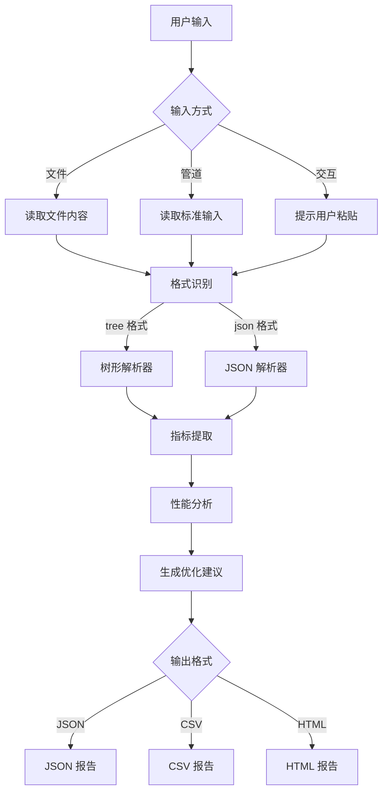
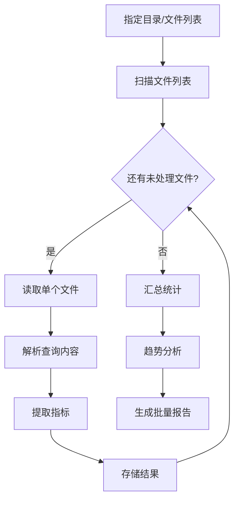

# MongoDB Query Analyzer - 产品需求文档

## 1. 产品概述

MongoDB Query Analyzer 是一个专业的 CLI 工具，用于解析 MongoDB 导出的非标格式文本（如带 ▾ 的树形 explain 输出），自动提取查询性能指标并生成统计报告，帮助开发者快速识别和优化慢查询。

目标用户：MongoDB 开发者、DBA、性能优化工程师
核心价值：将难以阅读的原生 explain 输出转换为结构化分析报告，提供可执行的优化建议

## 2. 核心功能

### 2.1 用户角色

| 角色    | 使用场景     | 核心需求            |
| ----- | -------- | --------------- |
| 开发工程师 | 本地调试查询性能 | 快速解析单条查询，获取优化建议 |
| DBA   | 批量分析生产日志 | 批量处理日志文件，生成汇总报告 |
| 运维工程师 | 监控查询性能趋势 | 定时分析，输出标准化报告    |

### 2.2 功能模块

MongoDB Query Analyzer 包含以下核心模块：

1. **输入解析模块**：支持文件输入、管道输入、标准输入，解析多种 MongoDB explain 格式
2. **指标提取模块**：提取执行时间、扫描文档数、索引使用情况、阶段详情等关键指标
3. **分析引擎模块**：基于提取的指标计算性能评分，识别慢查询和潜在问题
4. **优化建议模块**：根据分析结果生成针对性的查询优化建议
5. **报告生成模块**：支持 JSON、CSV、HTML 多种输出格式
6. **批量处理模块**：支持批量分析多个查询日志文件

### 2.3 功能详情

| 页面/模块   | 功能名称    | 功能描述                                                         |
| ------- | ------- | ------------------------------------------------------------ |
| CLI 主界面 | 命令解析    | 使用 commander.js 解析命令行参数，支持 --format、--output、--threshold 等选项 |
| CLI 主界面 | 帮助信息    | 显示工具使用方法、参数说明、示例命令                                           |
| 输入解析    | 文件输入    | 通过 --file 参数指定单个或多个 explain 输出文件路径                           |
| 输入解析    | 管道输入    | 支持 Unix 管道方式接收输入，如 `cat explain.txt \| mqa analyze`          |
| 输入解析    | 标准输入    | 支持交互式粘贴 explain 输出进行分析                                       |
| 输入解析    | 格式识别    | 自动识别 tree 格式（带 ▾）、json 格式、compact 格式                         |
| 输入解析    | 树形解析    | 解析带 ▾ 符号的树形 explain 输出，提取阶段层级关系                              |
| 指标提取    | 执行时间    | 提取 executionTimeMillis、totalDocsExamined 等核心指标               |
| 指标提取    | 扫描统计    | 提取 docsExamined、keysExamined、nReturned 等扫描数据                 |
| 指标提取    | 索引分析    | 识别索引使用情况，包括 winningPlan、rejectedPlans                        |
| 指标提取    | 阶段详情    | 提取 COLLSCAN、IXSCAN、FETCH 等各阶段的详细指标                           |
| 分析引擎    | 性能评分    | 基于执行时间、扫描比例计算 0-100 的性能评分                                    |
| 分析引擎    | 慢查询标记   | 根据阈值标记超过指定执行时间的慢查询                                           |
| 分析引擎    | 问题识别    | 识别全表扫描、内存排序、大量文档扫描等常见问题                                      |
| 优化建议    | 索引建议    | 针对未使用索引或低效索引提供创建/优化建议                                        |
| 优化建议    | 查询重写    | 提供查询条件优化、投影字段优化等建议                                           |
| 优化建议    | 分片建议    | 针对分片集合提供分片键优化建议                                              |
| 报告生成    | JSON 输出 | 生成结构化 JSON 报告，便于程序化处理                                        |
| 报告生成    | CSV 输出  | 生成 CSV 格式，便于导入 Excel 进行进一步分析                                 |
| 报告生成    | HTML 输出 | 生成可视化 HTML 报告，包含图表和交互式详情                                     |
| 批量处理    | 多文件处理   | 支持通配符或目录方式批量处理多个日志文件                                         |
| 批量处理    | 汇总统计    | 生成跨文件的汇总统计报告                                                 |
| 批量处理    | 趋势分析    | 对比多次分析结果，展示性能变化趋势                                            |

## 3. 核心流程

### 3.1 单查询分析流程

用户通过 CLI 输入 explain 输出内容，工具解析后提取性能指标，进行分析并生成优化建议，最后输出指定格式的报告。



### 3.2 批量分析流程

用户指定包含多个查询日志的目录或文件列表，工具逐个解析每个文件，提取指标后进行汇总统计，生成包含趋势分析的批量报告。



## 4. 用户界面设计

### 4.1 设计风格

* **整体风格**：专业、简洁的命令行界面，符合 Unix 工具设计哲学

* **颜色方案**：

  * 成功/正常：绿色 (#00C851)

  * 警告/注意：黄色 (#ffbb33)

  * 错误/严重：红色 (#ff4444)

  * 信息/中性：蓝色 (#33b5e5)

  * 高亮/强调：青色 (#00bcd4)

* **输出格式**：使用表格、进度条、树形结构等可视化元素增强可读性

* **字体**：使用等宽字体确保对齐，支持 Unicode 字符显示

### 4.2 命令设计

| 命令            | 功能     | 示例                                                    |
| ------------- | ------ | ----------------------------------------------------- |
| `mqa analyze` | 分析单个查询 | `mqa analyze --file explain.txt --format json`        |
| `mqa batch`   | 批量分析   | `mqa batch --dir ./logs --output report.html`         |
| `mqa compare` | 对比分析   | `mqa compare --before before.json --after after.json` |
| `mqa config`  | 配置管理   | `mqa config set threshold 100`                        |

### 4.3 输出示例

**控制台输出（简洁模式）**：

```
┌─────────────────────────────────────────┐
│  MongoDB Query Analysis Report          │
├─────────────────────────────────────────┤
│  Execution Time: 245ms                  │
│  Docs Examined: 10,000                  │
│  Docs Returned: 50                      │
│  Index Used: ✗ None (COLLSCAN)          │
│  Performance Score: 35/100 ⚠️           │
├─────────────────────────────────────────┤
│  Suggestions:                           │
│  1. Create index on { status: 1 }       │
│  2. Add projection to reduce fields     │
└─────────────────────────────────────────┘
```

**HTML 报告**：

* 顶部概览卡片：显示关键指标

* 性能趋势图表：使用 Chart.js 展示

* 查询详情表格：可展开查看完整执行计划

* 优化建议列表：带优先级标记

### 4.4 响应式设计

* **CLI 界面**：适配各种终端宽度，自动调整表格列宽

* **HTML 报告**：响应式布局，支持桌面和移动端查看

* **管道支持**：纯文本输出时禁用颜色代码，便于管道处理

## 5. 非功能性需求

### 5.1 性能要求

* 单文件解析：100KB 以内的 explain 输出应在 1 秒内完成

* 批量处理：支持同时处理 100+ 个文件

* 内存占用：处理大文件时内存占用不超过 100MB

### 5.2 兼容性要求

* **Node.js 版本**：支持 Node.js 18+

* **MongoDB 版本**：支持 MongoDB 4.0+ 的 explain 格式

* **操作系统**：支持 macOS、Linux、Windows

### 5.3 可靠性要求

* 解析失败时提供清晰的错误信息

* 支持部分解析（即使部分数据损坏也能提取有效信息）

* 提供调试模式输出详细日志

## 6. 使用场景示例

### 场景 1：开发调试

开发者在本地测试查询性能，将 explain("executionStats") 的输出保存到文件，使用工具快速分析：

```bash
mqa analyze --file query-explain.txt --format html --output report.html
```

### 场景 2：生产日志分析

DBA 需要分析过去一周的所有慢查询日志：

```bash
mqa batch --dir /var/log/mongodb/slow-queries --threshold 100 --output weekly-report.csv
```

### 场景 3：CI/CD 集成

在持续集成流程中自动检查查询性能：

```bash
cat explain-output.txt | mqa analyze --format json | jq '.score' | grep -q '^[0-6]' && echo "Performance check failed"
```

