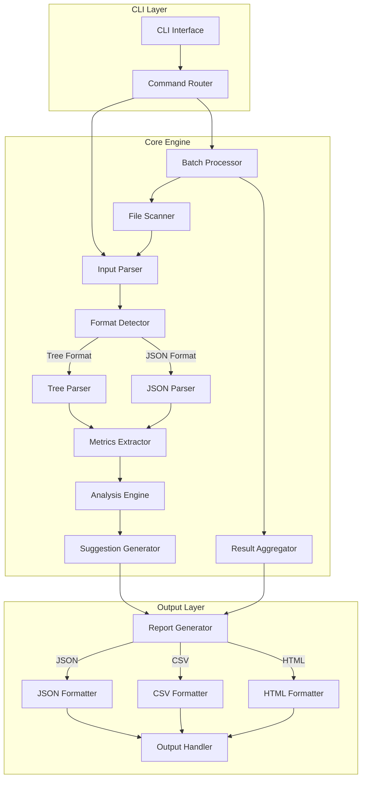

# MongoDB Query Analyzer - 技术架构文档

## 1. 架构设计



## 2. 技术描述

- **开发语言**: TypeScript 5.0+
- **运行时**: Node.js 18+
- **CLI 框架**: commander.js @11
- **构建工具**: tsc + esbuild（用于打包）
- **测试框架**: Jest @29
- **代码规范**: ESLint + Prettier
- **类型定义**: @types/node

### 核心依赖

| 依赖包 | 版本 | 用途 |
|--------|------|------|
| commander | ^11.0.0 | CLI 命令解析 |
| chalk | ^5.3.0 | 终端颜色输出 |
| cli-table3 | ^0.6.3 | 表格格式化 |
| ora | ^7.0.1 | 加载动画 |
| fast-csv | ^4.3.6 | CSV 生成 |
| handlebars | ^4.7.8 | HTML 模板引擎 |
| fs-extra | ^11.1.1 | 文件操作增强 |
| glob | ^10.3.0 | 文件匹配 |

## 3. 模块设计

### 3.1 目录结构

```
src/
├── cli/
│   ├── index.ts              # CLI 入口
│   ├── commands/
│   │   ├── analyze.ts        # analyze 命令
│   │   ├── batch.ts          # batch 命令
│   │   ├── compare.ts        # compare 命令
│   │   └── config.ts         # config 命令
│   └── options.ts            # 全局选项定义
├── parsers/
│   ├── index.ts              # 解析器入口
│   ├── format-detector.ts    # 格式检测器
│   ├── tree-parser.ts        # 树形格式解析器
│   └── json-parser.ts        # JSON 格式解析器
├── extractors/
│   ├── index.ts              # 提取器入口
│   ├── metrics-extractor.ts  # 指标提取器
│   └── stage-extractor.ts    # 阶段详情提取器
├── analyzers/
│   ├── index.ts              # 分析器入口
│   ├── performance-analyzer.ts # 性能分析器
│   └── issue-detector.ts     # 问题检测器
├── suggestions/
│   ├── index.ts              # 建议生成器入口
│   ├── index-suggester.ts    # 索引建议
│   └── query-suggester.ts    # 查询优化建议
├── reporters/
│   ├── index.ts              # 报告生成器入口
│   ├── json-reporter.ts      # JSON 报告
│   ├── csv-reporter.ts       # CSV 报告
│   └── html-reporter.ts      # HTML 报告
├── templates/
│   └── report.hbs            # HTML 报告模板
├── types/
│   └── index.ts              # TypeScript 类型定义
├── utils/
│   ├── file-reader.ts        # 文件读取工具
│   ├── logger.ts             # 日志工具
│   └── formatter.ts          # 格式化工具
└── config/
    └── default.ts            # 默认配置
```

### 3.2 核心接口定义

```typescript
// 解析结果接口
interface ParseResult {
  format: 'tree' | 'json' | 'compact';
  raw: string;
  parsed: ExplainOutput;
}

// Explain 输出结构
interface ExplainOutput {
  queryPlanner: QueryPlanner;
  executionStats?: ExecutionStats;
  serverInfo?: ServerInfo;
}

// 查询执行计划
interface QueryPlanner {
  namespace: string;
  indexFilterSet: boolean;
  parsedQuery: Record<string, any>;
  winningPlan: PlanStage;
  rejectedPlans?: PlanStage[];
}

// 执行统计
interface ExecutionStats {
  executionSuccess: boolean;
  nReturned: number;
  executionTimeMillis: number;
  totalKeysExamined: number;
  totalDocsExamined: number;
  executionStages: PlanStage;
  allPlansExecution?: PlanStage[];
}

// 计划阶段
interface PlanStage {
  stage: string;
  nReturned?: number;
  executionTimeMillisEstimate?: number;
  works?: number;
  advanced?: number;
  docsExamined?: number;
  keysExamined?: number;
  inputStage?: PlanStage;
  inputStages?: PlanStage[];
  indexName?: string;
  keyPattern?: Record<string, number>;
  direction?: string;
}

// 提取的指标
interface QueryMetrics {
  executionTimeMillis: number;
  nReturned: number;
  totalDocsExamined: number;
  totalKeysExamined: number;
  docsPerReturn: number;
  indexUsed: boolean;
  indexName?: string;
  scanType: 'COLLSCAN' | 'IXSCAN' | 'COUNT_SCAN' | 'COUNT' | 'IDHACK' | 'TEXT' | 'PROJECTION' | 'other';
  stages: StageMetrics[];
}

// 阶段指标
interface StageMetrics {
  stage: string;
  nReturned: number;
  executionTimeMillisEstimate: number;
  docsExamined?: number;
  keysExamined?: number;
  indexName?: string;
  keyPattern?: Record<string, number>;
}

// 分析报告
interface AnalysisReport {
  metrics: QueryMetrics;
  score: number;
  issues: Issue[];
  suggestions: Suggestion[];
  timestamp: string;
}

// 问题定义
interface Issue {
  type: 'critical' | 'warning' | 'info';
  category: 'scan' | 'index' | 'memory' | 'sort' | 'other';
  message: string;
  details?: Record<string, any>;
}

// 优化建议
interface Suggestion {
  priority: 'high' | 'medium' | 'low';
  category: 'index' | 'query' | 'schema' | 'sharding';
  title: string;
  description: string;
  example?: string;
}
```

## 4. 核心算法

### 4.1 树形格式解析算法

树形 explain 输出使用缩进和特殊字符（▾）表示层级关系，解析器需要：

1. 按行分割输入
2. 识别缩进级别（空格或制表符数量）
3. 构建父子关系树
4. 提取每行的键值对

```
示例输入：
└─ COLLSCAN 
   ├─ nReturned: 1000
   ├─ docsExamined: 10000
   └─ direction: forward
```

### 4.2 性能评分算法

基于多个维度计算 0-100 的性能评分：

```typescript
function calculateScore(metrics: QueryMetrics): number {
  // 基础分数
  let score = 100;
  
  // 执行时间扣分（超过 100ms 开始扣分）
  if (metrics.executionTimeMillis > 100) {
    score -= Math.min(30, (metrics.executionTimeMillis - 100) / 10);
  }
  
  // 扫描比例扣分（扫描文档数/返回文档数）
  const scanRatio = metrics.totalDocsExamined / Math.max(1, metrics.nReturned);
  if (scanRatio > 10) {
    score -= Math.min(40, (scanRatio - 10) * 2);
  }
  
  // 未使用索引扣分
  if (!metrics.indexUsed) {
    score -= 20;
  }
  
  // 全表扫描额外扣分
  if (metrics.scanType === 'COLLSCAN') {
    score -= 10;
  }
  
  return Math.max(0, Math.round(score));
}
```

### 4.3 索引建议算法

根据查询条件和现有索引情况生成建议：

1. 分析查询条件中的字段
2. 检查是否有匹配的索引
3. 评估索引选择性
4. 生成创建索引的建议

## 5. 命令行接口

### 5.1 全局选项

| 选项 | 简写 | 类型 | 默认值 | 描述 |
|------|------|------|--------|------|
| --format | -f | string | json | 输出格式 (json/csv/html) |
| --output | -o | string | stdout | 输出文件路径 |
| --threshold | -t | number | 100 | 慢查询阈值 (ms) |
| --verbose | -v | boolean | false | 详细输出模式 |
| --silent | -s | boolean | false | 静默模式 |
| --color | -c | boolean | true | 启用颜色输出 |
| --config | | string | ~/.mqa/config.json | 配置文件路径 |

### 5.2 analyze 命令

分析单个 explain 输出。

```bash
mqa analyze [options]
```

**选项**：
| 选项 | 简写 | 类型 | 描述 |
|------|------|------|------|
| --file | -f | string | 输入文件路径 |
| --stdin | | boolean | 从标准输入读取 |

**示例**：
```bash
# 从文件分析
mqa analyze --file explain.txt --format html --output report.html

# 从管道分析
cat explain.txt | mqa analyze --format json

# 交互式输入
mqa analyze --stdin
```

### 5.3 batch 命令

批量分析多个文件。

```bash
mqa batch [options]
```

**选项**：
| 选项 | 简写 | 类型 | 描述 |
|------|------|------|------|
| --dir | -d | string | 目录路径 |
| --pattern | -p | string | 文件匹配模式 |
| --recursive | -r | boolean | 递归子目录 |
| --aggregate | -a | boolean | 生成汇总报告 |

**示例**：
```bash
# 分析整个目录
mqa batch --dir ./logs --format csv --output batch-report.csv

# 使用通配符
mqa batch --pattern "*.explain" --recursive
```

### 5.4 compare 命令

对比两次分析结果。

```bash
mqa compare [options]
```

**选项**：
| 选项 | 简写 | 类型 | 描述 |
|------|------|------|------|
| --before | -b | string | 优化前报告文件 |
| --after | -a | string | 优化后报告文件 |

**示例**：
```bash
mqa compare --before before.json --after after.json --format html
```

## 6. 数据模型

### 6.1 配置文件结构

```json
{
  "threshold": {
    "slowQuery": 100,
    "verySlowQuery": 1000
  },
  "scoring": {
    "weights": {
      "executionTime": 0.3,
      "scanRatio": 0.4,
      "indexUsage": 0.3
    }
  },
  "output": {
    "defaultFormat": "json",
    "colorize": true,
    "tableStyle": "compact"
  },
  "suggestions": {
    "enableIndexSuggestions": true,
    "enableQuerySuggestions": true,
    "minSelectivity": 0.1
  }
}
```

### 6.2 JSON 报告结构

```json
{
  "version": "1.0.0",
  "generatedAt": "2024-01-15T10:30:00Z",
  "summary": {
    "totalQueries": 1,
    "slowQueries": 1,
    "avgScore": 45
  },
  "queries": [
    {
      "id": "query-001",
      "namespace": "test.users",
      "metrics": {
        "executionTimeMillis": 245,
        "nReturned": 50,
        "totalDocsExamined": 10000,
        "totalKeysExamined": 0,
        "indexUsed": false,
        "scanType": "COLLSCAN"
      },
      "score": 35,
      "issues": [
        {
          "type": "critical",
          "category": "scan",
          "message": "Full collection scan detected"
        }
      ],
      "suggestions": [
        {
          "priority": "high",
          "category": "index",
          "title": "Create index on query field",
          "description": "Add index on { status: 1 } to avoid collection scan",
          "example": "db.users.createIndex({ status: 1 })"
        }
      ]
    }
  ]
}
```

## 7. 测试策略

### 7.1 单元测试

- 解析器测试：覆盖 tree/json/compact 格式
- 提取器测试：验证指标提取准确性
- 分析器测试：验证评分算法
- 建议器测试：验证建议生成逻辑

### 7.2 集成测试

- 端到端 CLI 测试
- 不同 MongoDB 版本兼容性测试
- 大文件处理性能测试

### 7.3 测试数据

```
test/
├── fixtures/
│   ├── tree-format/
│   │   ├── simple-query.txt
│   │   ├── complex-aggregation.txt
│   │   └── index-scan.txt
│   ├── json-format/
│   │   ├── winning-plan.json
│   │   └── all-plans.json
│   └── expected/
│       ├── simple-query-result.json
│       └── complex-aggregation-result.json
└── integration/
    └── cli.test.ts
```

## 8. 构建与发布

### 8.1 构建流程

```bash
# 安装依赖
npm install

# 编译 TypeScript
npm run build

# 运行测试
npm test

# 打包可执行文件
npm run package
```

### 8.2 发布配置

```json
{
  "name": "mongodb-query-analyzer",
  "version": "1.0.0",
  "description": "CLI tool for analyzing MongoDB query performance",
  "main": "dist/index.js",
  "bin": {
    "mqa": "dist/cli/index.js"
  },
  "scripts": {
    "build": "tsc",
    "test": "jest",
    "lint": "eslint src/**/*.ts",
    "package": "pkg dist/cli/index.js -o bin/mqa"
  },
  "keywords": ["mongodb", "query", "performance", "analyzer", "cli"],
  "license": "MIT"
}
```

## 9. 错误处理

### 9.1 错误码定义

| 错误码 | 描述 | 处理建议 |
|--------|------|----------|
| E001 | 文件不存在 | 检查文件路径是否正确 |
| E002 | 格式解析失败 | 检查输入是否为有效的 explain 输出 |
| E003 | 不支持的格式 | 使用 --format 指定正确的格式 |
| E004 | 权限不足 | 检查文件读取权限 |
| E005 | 内存不足 | 使用流式处理大文件 |

### 9.2 日志级别

- **ERROR**: 严重错误，程序无法继续执行
- **WARN**: 警告，可能影响结果准确性
- **INFO**: 一般信息，正常执行流程
- **DEBUG**: 调试信息，仅在 verbose 模式输出

## 10. 扩展性设计

### 10.1 插件机制

支持自定义解析器和报告生成器：

```typescript
interface ParserPlugin {
  name: string;
  detect: (input: string) => boolean;
  parse: (input: string) => ExplainOutput;
}

interface ReporterPlugin {
  name: string;
  format: string;
  generate: (report: AnalysisReport) => string;
}
```

### 10.2 配置扩展

支持用户自定义配置覆盖默认配置：

```typescript
// 配置加载优先级（从高到低）
// 1. 命令行参数
// 2. 环境变量 (MQA_*)
// 3. 用户配置文件 (~/.mqa/config.json)
// 4. 项目配置文件 (./.mqarc.json)
// 5. 默认配置
```
